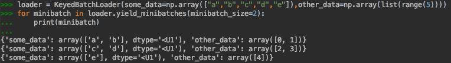

# Key Concepts
## Focus on end-to-end pipelines


What we care for in the end is the actual performance on a specific task - be it some text classification or language modelling.
In order to allow for a fair comparison, the actual evaluation should be exactly the same as we simply switch through
the models to evaluate. Self-contained models make this a lot easier, as any interference with their environment is well-described
by the interface they implement.


The same is true in production environments where model architectures can be different while their actual usage is the same.
For instance, a sentiment module could consist of different architectures that are fine-tuned for specific semantic topics, respectively.
In such a case, we would prefer every single model to be easily switchable to another architecture as the data might favor another configuration.
Using self-contained end-to-end pipelines make this much easier, as we do not have to care about possible side-effects of using
single model components that might not fit to each other.

## Dynamic model pipelines
Different model architectures often behave differently when it comes to how they process data. For instance,
the way of how to tokenize text can differ, sometimes a given model expects the same kind of data under another name
or additional input data can appear that a third model does not use. As we want to plug all those into a shared evaluation pipeline,
we expect them to implement a common interface so that a given evaluation pipeline can easily interact with the models.
As python is not hindered by parametric polymorphism, we can change the input signature for instance of the method that optimizes
the parameters of a given model to the data that it specifically needs rather than hard-coding arguments.
Moreover, if we abstract away the actual name of such function arguments and rather pass them as keyword arguments,
we are free to rapidly change the semantics of the evaluation pipeline to fit it to various different models:

```python
def train(self, **kwargs) -> "DeepModel":
    ...
```

As an example, let's think about two models that assign some labels to email messages - one that expects the entire message body
of an email as input and another one that expects pre-split message clauses and additionally takes the subject line into consideration.
The actual semantics in terms of what the models are trying to achieve here is the same -
take some textual input and return some label, only the data passed to the models differ.
As we specifically focus on end-to-end pipelines, the actual implementation of how the data interacts with the
model is implemented inside of the model.
Hence, we only have to change the DataLoader that is passed to the evaluation (as well as the model),
the remaining code stays the same:

```python

# ignore model implementation for now
# first model expects whole message bodies as single strings
model_0: Classifier = ...
# second model expects single clauses and a subject line
model_1: Classifier = ...

# define data for each model
# KeyedBatchLoader objects take named data sequences as input and yield mini-batches over them
data_loader_0 = KeyedBatchLoader(message_bodies=message_bodies,
                                labels=labels)

data_loader_1 = KeyedBatchLoader(clauses=clauses,
                                subjects=subjects,
                                labels=labels)

# train model
for model, data_loader in [(model_0, data_loader_0),
                          (model_1, data_loader_1)]:
    trainer = Trainer(
        data_loader=data_loader,
        # list of minibatch callbacks
        minibatch_callbacks=[
        ],
        # list of full bach callbacks
        batch_callbacks=[
        ])
    # the trainer recieves the data from the data_loader and passes it to the model
    trainer.train_model(model=model, n_iterations=10)

```


## Types make sense
While Python does not provide proper type-checking, it does allow for both type hints and type aliases.
For instance, imagine we have a simple function that takes a string and preprocesses it into a list of tokens, which are strings themselves:
```python
def preprocess(x):
    #TODO
```
General consensus would tell us that the function argument should be named to something more informative such as `text`.
Moreover, we can add type hints that allow for a better understanding of what kind of data the function expects and returns:
```python
def preprocess(text:str)->List[str]:
    #TODO
```
Already much better! We now know that the function expects a string and returns a list of strings.
Now, imagine a case where the function can alternatively tokenize both a single input text or a batch of several texts,
for instance to parallelize it:
```python
def preprocess(data:Union[str,List[str]])->Union[List[str],List[List[str]]]:
    #TODO
```
Now we are in a point where type hints make our lives harder as they become more complex. Not only are they hard to read,
they become ambiguous - is the list of input strings now a list of texts or a single text that is already tokenized?
Fortunately, python allows for type aliases - we can give more complex types individual names that makes them easier to understand:
```python
def preprocess(data:Union[RawText,ListOfRawTexts])->Union[TokenizedText,ListOfTokenizedTexts]:
    #TODO
```
Now we know for sure how the function behaves semantically - it returns raw texts and returns some form of tokenized version of them!

# Overview over all involved classes
Once we have defined a model, we want to train and evaluate it! The training of a model is managed by a Trainer object,
which also calls a list of callbacks after every mini-batch and full batch.


## Model API

When building bigger code bases, re-using existing code is crucial to save time and reduce bugs.
While traditional subclassing helps in re-using code, it is not always optimal.
For instance, imagine a case where we have trained a language model and want to use its encoder for other NLP tasks.
Decomposability of an object into its single parts plays an important part here, and is fully supported by the __Layer API__.


Moreover, when developing a model, its usage can often be decoupled from its actual architecture. For instance,
an autoregressive model such as an LST or GRU can be used to work on images, texts, weather data and other kinds of information -
only the data pipeline itself defines how the model is actually used. In such a case, we suggest using __mixins__ rather
than traditional subclassing. Mixins offer ready-to-go implementations for all kinds of usage cases - just implement
one or two missing methods that link your model to the predefined code to start!

## Model object fields
Models can have several members, and they can vary a lot, given the respective architecture.
The Model API distinguishes components that are serialized to store and retrieve a model,
layers that are a specific kind of components used in the Layer API and ad hoc class members that are never serialized.


### Model components
Model components define the state of a given model object in time - they are the parts needed to construct such a model
and are extracted during derialization and saved individually. A single component can be any python object, such as a simple
pre-processing object that turns textual input into feature vectors, a keras model or single float value that is used
as a hyper-parameter.


The components of a model are defined in the `from_components(**kwargs)` and `get_components(self)` methods.
For instance, a wrapper around a keras classifier might include these lines:

```python
    @classmethod
    def from_components(cls, **kwargs) -> "DeepModel":
        return cls(**kwargs)

    def get_components(self) -> dict:
        return {
            "keras_model": self.keras_model,
            "label_mapper": self.label_mapper,
            "tokenizer": self.tokenizer,
            "maxlen": self.maxlen,
            "text_kw": self.text_kw,
            "label_kw": self.label_kw
        }
```

`get_components(self)` here defines the components that are serialized - the actual keras model, objects that handle the
 pre- and post-processing of data and some hyper-parameters.

`from_components(cls, **kwargs)` takes those components and re-creates the model from its parts by passing them as
keyword arguments to the respective constructor.

### DeepModelBase
- Abstract base class for objects that either do not have optimizable parameters (preprocessing layers etc)
 or do have them, but the loss is still undefined (e.g. a single layer in a bigger model)

- Automatic saving and loading of models is currently implemented for fastai rnn learners,
keras, pytorch and other models that can be serialized via joblib.

- Contains abstract methods to train, save and (de)construct models from (into) their single components.


### DeepModel
- Abstract base class for optimizable end-to-end deep models with defined loss function.


## Classifier(DeepModel)
- ABC for simple classifiers

- methods to yield label probabilities and labels

- label detection is implemented as argmax over label probabilities and then mapping the label indices to actual labels.
 Can be overwritten, though.


## EmbeddingModel(DeepModel)
- ABC for embedding models

- single method to embed data.


## StatefulModel(DeepModelBase)
- ABC for models that are explicitly stateful, e.g recurrent models such as LSTMs.

- Does not assume any prior specification of how model state is implemented or stored,
but assumes it can be passed to the model as a single object


- Expects method implementations for getting / setting the current state as well as getting a default state (i.e. initial state).
 Implements model reset as `self.set_state(self.get_default_state())`, which can be overwritten


## Layer API
The layer API is a framework that allows for building decomposable model pipelines,
especially useful for custom transfer learning models.
Every layer can consist of additional layers. If data is pushed through a layered model,
it traverses the tree in a depth-first manner and annotates the input as
implemented in the respective `push(**kwargs)` method of every layer:


### Layer Slicing
Via the Layer API you can slice a model into into its respective components for further reuse.
Slicing can be done via explicit slice objects (`some_model[0:1]`) or in the case of singleton extractions
also via passing the index (`some_layer[0]`) or name (`some_layer[“layer_0“]`) of the layer to extract.
Alternatively you can also extract the layer name as an actual field (`some_model.layers.some_layer`):


As a real life example, take the shared layers between language models, text embedding models and text classifiers:


## StatefulLayeredModel
Also layered models can be stateful. For instance, you can have a transfer learning model based on an LSTM,
which is inherently stateful. In such cases, calling e.g. `model.get_state()` will return all states of the
corresponding sub-layers as nested lists. Again, the actual data structure of a single state depends on the model.


StatefulLayeredModel also implements an `unroll()` method that input subsequences through the
pipeline to allow for truncated back-propagation through time.


# Trainer

- Trains model on data and returns it

 - Expects model to train

 - Named training data (as the model would expect it)

 - List of callbacks to be called after every mini-batch

 - List of callbacks to be called after every full iteration

 - Number of iterations to train

 - Mini-batch size during training


```python
trainer = Trainer(
    data_loader=KeyedBatchLoader(
        # add additional data here. name should correspond to implemention of model
        # e.g. if it expects some data named "sentiment", add sentiment=some_data
        clauses=X_train,
        labels=Y_train),
    # list of minibatch callbacks
    minibatch_callbacks=[
    ],
    # list of full bach callbacks
    batch_callbacks=[
    ])
```


We can add various callbacks to it:

```python
trainer = Trainer(
    data_loader=KeyedBatchLoader(
        # add additional data here. name should correspond to implemention of model
        # e.g. if it expects some data named "sentiment", add sentiment=some_data
        clauses=X_train,
        labels=Y_train),
    # list of minibatch callbacks
    minibatch_callbacks=[
        # check that no parameter is NaN
        CheckNan()
    ],
    # list of full bach callbacks
    batch_callbacks=[
        # run evaluation on subsampled training data (for bigger training sets that might take ages)
        EvaluationCallBack.default(folder_path=os.path.join(MODEL_FOLDER, "evaluation_data", "train"),
                                   data_loader=KeyedSubsampledBatchLoader(n_subsampled=1024,
                                                                          clauses=X_train,
                                                                          labels=Y_train),
                                   label_indices=corpus.label_mapper.indices),
        # run evaluation on test data
        EvaluationCallBack.default(folder_path=os.path.join(MODEL_FOLDER, "evaluation_data", "test"),
                                   data_loader=KeyedBatchLoader(clauses=X_test,
                                                                labels=Y_test),
                                   label_indices=corpus.label_mapper.indices),
        # save parameter values for tensorboard
        PlotParameters(folder_path=os.path.join(MODEL_FOLDER, "parameters")),
        # save embeddings for tensorboard
        PlotClassificationEmbeddings(
            folder_path=os.path.join(MODEL_FOLDER, "embeddings"),
            data_loader=KeyedBatchLoader(
                clauses=X_test,
                labels=Y_test),
            label_kw="labels"
        ),
        # finally save model
        ModelSaverCallback(
            model_saver=QueuedModelSaver(
                path_to_folder=os.path.join(MODEL_FOLDER, "saved_models"),
                model_name=MODEL_NAME,
                queue_size=2))
    ])
```

# Data-related classes

## DataLoader
Classes that lazily yield mini-batches of data


## EagerDataLoader(DataLoader)
evaluated data eagerly, i.e. has all the data in memory all the time. Useful to plot progress bars during training as you need the total number of mini-batches per full iteration


## LazyDataLoader(DataLoader)
evaluated data lazily, i.e. only loads data once it its needed. Useful for infinitely big data sets (online training, fetching data for language models via a crawler, …)


## KeyedBatchLoader(EagerDataLoader)
- Takes single data arrays as keyword arguments and yields mini-batches as dictionary, mapping from data name to data values.
- Should be used as a default, since the DeepModel API expects data as keyword arguments, too.




## KeyedSubsampledBatchLoader(EagerDataLoader)
- Same as KeyedBatchLoader, but only yields mini-batches over a subsample of the full data set.

- That subsample is resampled for every iteration

- Used to yield subset of training set to approximate loss on whole training data during evaluation (otherwise would take ages)


## KeyedLazyDataLoader(LazyDataLoader)
- Same as KeyedBatchLoader, but lazy.

- For bigger / infinitely big data sets.

# The .model file


- Every model is saved in a .model file

- Really just a gzipped tar archive containing

 - metadata.json

    - module name of saved deep model

    - class name of saved model
 ```json
 {
    "module": "deep_learning.model.transformer_clf",
    "cls": "TransformerModel"
 }
 ```

 - folders for all backends that the model uses

    - contain backend-specific serialization formats


# Running the evaluation
- run the evaluation via evaluate.py at the root of the project

- trains the model and runs additional callbacks

- results are saved in a given folder


# Tensorboard
There are currently several callbacks that store statistics that can be read via tensorboard.
To boot up tensorboard, make sure you have installed tensorflow in your virtual environment
(should be the case if you have install all dependencies of the project).

Then simply run tensorboard via
`tensorboard --logdir=path/to/your/model/folder`


# Suggested Workflow
- Implement your DeepModel

- If it needs additional data, add that to the KeyedBatchLoaders that feed the trainer and callbacks

- If you need any additional callbacks, implement those and add them to your trainer

- Run your evaluation script

- You should see stuff like this:

```
training iteration 0
100%|██████████| 1/1 [00:00<00:00, 25.44it/s]
training iteration 1
100%|██████████| 1/1 [00:00<00:00, 32.86it/s]
training iteration 2
100%|██████████| 1/1 [00:00<00:00, 29.30it/s]
training iteration 3
100%|██████████| 1/1 [00:00<00:00, 29.63it/s]
```