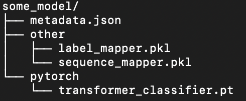

# Key Concepts
## Focus on end-to-end pipelines


What we care for in the end is the actual performance on a specific task - be it some text classification or language modelling.
In order to allow for a fair comparison, the actual evaluation should be exactly the same as we simply switch through
the models to evaluate. Self-contained models make this a lot easier, as any interference with their environment is well-described
by the interface they implement.


The same is true in production environments where model architectures can be different while their actual usage is the same.
For instance, a sentiment module could consist of different architectures that are fine-tuned for specific semantic topics, respectively.
In such a case, we would prefer every single model to be easily switchable to another architecture as the data might favor another configuration.
Using self-contained end-to-end pipelines make this much easier, as we do not have to care about possible side-effects of using
single model components that might not fit to each other.

## Dynamic model pipelines
Different model architectures often behave differently when it comes to how they process data. For instance,
the way of how to tokenize text can differ, sometimes a given model expects the same kind of data under another name
or additional input data can appear that a third model does not use. As we want to plug all those into a shared evaluation pipeline,
we expect them to implement a common interface so that a given evaluation pipeline can easily interact with the models.
As python is not hindered by parametric polymorphism, we can change the input signature for instance of the method that optimizes
the parameters of a given model to the data that it specifically needs rather than hard-coding arguments.
Moreover, if we abstract away the actual name of such function arguments and rather pass them as keyword arguments,
we are free to rapidly change the semantics of the evaluation pipeline to fit it to various different models:

```python
def train(self, **kwargs) -> "DeepModel":
    ...
```

As an example, let's think about two models that assign some labels to email messages - one that expects the entire message body
of an email as input and another one that expects pre-split message clauses and additionally takes the subject line into consideration.
The actual semantics in terms of what the models are trying to achieve here is the same -
take some textual input and return some label, only the data passed to the models differ.
As we specifically focus on end-to-end pipelines, the actual implementation of how the data interacts with the
model is implemented inside of the model.
Hence, we only have to change the DataLoader that is passed to the evaluation (as well as the model),
the remaining code stays the same:

```python

# ignore model implementation for now
# first model expects whole message bodies as single strings
model_0: Classifier = ...
# second model expects single clauses and a subject line
model_1: Classifier = ...

# define data for each model
# KeyedBatchLoader objects take named data sequences as input and yield mini-batches over them
data_loader_0 = KeyedBatchLoader(message_bodies=message_bodies,
                                labels=labels)

data_loader_1 = KeyedBatchLoader(clauses=clauses,
                                subjects=subjects,
                                labels=labels)

# train model
for model, data_loader in [(model_0, data_loader_0),
                          (model_1, data_loader_1)]:
    trainer = Trainer(
        data_loader=data_loader,
        # list of mini-batch callbacks
        minibatch_callbacks=[
        ],
        # list of full batch callbacks
        batch_callbacks=[
        ])
    # the trainer receives the data from the data_loader and passes it to the model
    trainer.train_model(model=model, n_iterations=10)

```


## Types make sense
While Python does not provide proper type-checking, it does allow for both type hints and type aliases.
For instance, imagine we have a simple function that takes a string and preprocesses it into a list of tokens, which are strings themselves:
```python
def preprocess(x):
    #TODO
```
General consensus would tell us that the function argument should be named to something more informative such as `text`.
Moreover, we can add type hints that allow for a better understanding of what kind of data the function expects and returns:
```python
def preprocess(text:str)->List[str]:
    #TODO
```
Already much better! We now know that the function expects a string and returns a list of strings.
Now, imagine a case where the function can alternatively tokenize both a single input text or a batch of several texts,
for instance to parallelize it:
```python
def preprocess(data:Union[str,List[str]])->Union[List[str],List[List[str]]]:
    #TODO
```
Now we are in a point where type hints make our lives harder as they become more complex. Not only are they hard to read,
they become ambiguous - is the list of input strings now a list of texts or a single text that is already tokenized?
Fortunately, python allows for type aliases - we can give more complex types individual names that makes them easier to understand:
```python
def preprocess(data:Union[RawText,ListOfRawTexts])->Union[TokenizedText,ListOfTokenizedTexts]:
    #TODO
```
Now we know for sure how the function behaves semantically - it returns raw texts and returns some form of tokenized version of them!

# Overview over all involved classes
Once we have defined a model, we want to train and evaluate it! The training of a model is managed by a Trainer object,
which also calls a list of callbacks after every mini-batch and full batch.


## Model API

When building bigger code bases, re-using existing code is crucial to save time and reduce bugs.
While traditional subclassing helps in re-using code, it is not always optimal.
For instance, imagine a case where we have trained a language model and want to use its encoder for other NLP tasks.
Decomposability of an object into its single parts plays an important part here, and is fully supported by the __Layer API__.


Moreover, when developing a model, its usage can often be decoupled from its actual architecture. For instance,
an autoregressive model such as an LST or GRU can be used to work on images, texts, weather data and other kinds of information -
only the data pipeline itself defines how the model is actually used. In such a case, we suggest using __mixins__ rather
than traditional subclassing. Mixins offer ready-to-go implementations for all kinds of usage cases - just implement
one or two missing methods that link your model to the predefined code to start!

## Model object fields
Models can have several members, and they can vary a lot, given the respective architecture.
The Model API distinguishes components that are serialized to store and retrieve a model,
layers that are a specific kind of components used in the Layer API and ad hoc class members that are never serialized.


### Model components
Model components define the state of a given model object in time - they are the parts needed to construct such a model
and are extracted during derialization and saved individually. A single component can be any python object, such as a simple
pre-processing object that turns textual input into feature vectors, a keras model or single float value that is used
as a hyper-parameter.


The components of a model are defined in the `from_components(**kwargs)` and `get_components(self)` methods.
For instance, a wrapper around a keras classifier might include these lines:

```python
    @classmethod
    def from_components(cls, **kwargs) -> "DeepModel":
        return cls(**kwargs)

    def get_components(self) -> dict:
        return {
            "keras_model": self.keras_model,
            "label_mapper": self.label_mapper,
            "tokenizer": self.tokenizer,
            "maxlen": self.maxlen,
            "text_kw": self.text_kw,
            "label_kw": self.label_kw
        }
```

`get_components(self)` here defines the components that are serialized - the actual keras model, objects that handle the
 pre- and post-processing of data and some hyper-parameters.

`from_components(cls, **kwargs)` takes those components and re-creates the model from its parts by passing them as
keyword arguments to the respective constructor.

### The .model file



- Every model is saved in a .model file

- Really just a gzipped tar archive containing

 - metadata.json

    - module name of saved deep model

    - class name of saved model
 ```json
 {
    "module": "deep_learning.model.transformer_clf",
    "cls": "TransformerModel"
 }
 ```

 - folders for all backends that the model uses

    - contain backend-specific serialization formats


# Model classes

### DeepModelBase
- Abstract base class for objects that either do not have optimizable parameters (preprocessing layers etc)
 or do have them, but the loss is still undefined (e.g. a single layer in a bigger model)

- Automatic saving and loading of models is currently implemented for fastai rnn learners,
keras, pytorch and other models that can be serialized via joblib.

- Contains abstract methods to train, save and (de)construct models from (into) their single components.


### DeepModel
- Abstract base class for optimizable end-to-end deep models with defined loss function.


## Classifier(DeepModel)
- ABC for simple classifiers

- methods to yield label probabilities and labels

- label detection is implemented as argmax over label probabilities and then mapping the label indices to actual labels.
 Can be overwritten, though.


## EmbeddingModel(DeepModel)
- ABC for embedding models

- single method to embed data.


## StatefulModel(DeepModelBase)
- ABC for models that are explicitly stateful, e.g recurrent models such as LSTMs.

- Does not assume any prior specification of how model state is implemented or stored,
but assumes it can be passed to the model as a single object


- Expects method implementations for getting / setting the current state as well as getting a default state (i.e. initial state).
 Implements model reset as `self.set_state(self.get_default_state())`, which can be overwritten


## Layer API
The layer API is a framework that allows for building decomposable model pipelines,
especially useful for custom transfer learning models.
Every layer can consist of additional layers. If data is pushed through a layered model,
it traverses the tree in a depth-first manner and annotates the input as
implemented in the respective `push(**kwargs)` method of every layer:


### Layer Slicing
Via the Layer API you can slice a model into into its respective components for further reuse.
Slicing can be done via explicit slice objects (`some_model[0:1]`) or in the case of singleton extractions
also via passing the index (`some_layer[0]`) or name (`some_layer[“layer_0“]`) of the layer to extract.
Alternatively you can also extract the layer name as an actual field (`some_model.layers.some_layer`):


As a real life example, take the shared layers between language models, text embedding models and text classifiers:


## StatefulLayeredModel
Also layered models can be stateful. For instance, you can have a transfer learning model based on an LSTM,
which is inherently stateful. In such cases, calling e.g. `model.get_state()` will return all states of the
corresponding sub-layers as nested lists. Again, the actual data structure of a single state depends on the model.


StatefulLayeredModel also implements an `unroll()` method that input subsequences through the
pipeline to allow for truncated back-propagation through time.


## Trainer

While every DeepModel instance implements a `def train(self, **kwargs) -> "DeepModel"` method that
performs a single optimization step on a given data set, the overall training procedure usually contains
more than that - you usually split the training data into separate mini-batches, anneal certain hyper-parameters 
or send model statistics to some visualization tool. Instances of the 
`Trainer` class and its subclasses aim to automate those steps. 


### Data Loader

Every `Trainer` object expects a `KeyedBatchLoader` instance yielding the training data that is passed to the model
during the course of the optimization procedure. Here we have to make sure that the names given to the single data types
fit to what the model itself expects. For instance, if we have text classifier that expects `clauses` as text input 
and `labels` as target values, we assign these names to the data loader as well:

```python
# X_train and Y_train are numpy arrays
data_loader = KeyedBatchLoader(clauses=X_train, labels=Y_train)
```

### Trainer callbacks
Once a single mini-batch is passed to the model inside of a `Trainier` instance, a list of `TrainerCallback` instances is called. 
They implement a `def __call__(...) -> DeepModel:
` method that takes the current model, interacts with it and finally returns it. For instance, we can add an
instance of the `CheckNaN` class to that list of callbacks to make sure the model is numerically stable. 

After a full iteration over the training data, another list of `TrainerCallback` instances is called. 
For example, we can evaluate the model on a test set via an `EvaluationCallBack` object or pass it to
a `ModelSaverCallback` instance that serializes the last _n_ model states 
and discards the previous ones.


As an example, a trainer without any callbacks would simple train a model and return it:
```python
trainer = Trainer(
    data_loader=KeyedBatchLoader(
        # add additional data here. name should correspond to implemention of model
        # e.g. if it expects some data named "sentiment", add sentiment=some_data
        clauses=X_train,
        labels=Y_train),
    # list of minibatch callbacks
    minibatch_callbacks=[
    ],
    # list of full bach callbacks
    batch_callbacks=[
    ])
```


With various callbacks added, we can log the training procedure, plot data embeddings and save the respective 
model states after every full iterations over the data:

```python
trainer = Trainer(
    data_loader=KeyedBatchLoader(
        # add additional data here. name should correspond to implemention of model
        # e.g. if it expects some data named "sentiment", add sentiment=some_data
        clauses=X_train,
        labels=Y_train),
    # list of minibatch callbacks
    minibatch_callbacks=[
        # check that no parameter is NaN
        CheckNan()
    ],
    # list of full bach callbacks
    batch_callbacks=[
        # run evaluation on subsampled training data (for bigger training sets a full sweep might take some time)
        EvaluationCallBack.default(folder_path=os.path.join(MODEL_FOLDER, "evaluation_data", "train"),
                                   data_loader=KeyedSubsampledBatchLoader(n_subsampled=1024,
                                                                          clauses=X_train,
                                                                          labels=Y_train),
                                   label_indices=corpus.label_mapper.indices),
        # run evaluation on test data
        EvaluationCallBack.default(folder_path=os.path.join(MODEL_FOLDER, "evaluation_data", "test"),
                                   data_loader=KeyedBatchLoader(clauses=X_test,
                                                                labels=Y_test),
                                   label_indices=corpus.label_mapper.indices),
        # save parameter values for tensorboard
        PlotParameters(folder_path=os.path.join(MODEL_FOLDER, "parameters")),
        # save embeddings for tensorboard
        PlotClassificationEmbeddings(
            folder_path=os.path.join(MODEL_FOLDER, "embeddings"),
            data_loader=KeyedBatchLoader(
                clauses=X_test,
                labels=Y_test),
            label_kw="labels"
        ),
        # finally save model
        ModelSaverCallback(
            model_saver=QueuedModelSaver(
                path_to_folder=os.path.join(MODEL_FOLDER, "saved_models"),
                model_name=MODEL_NAME,
                queue_size=2))
    ])
```

### Training a model
Once we have defined the optimization procedure via callbacks, we can finally start the training.
Every trainer implements the `def train_model(...) -> DeepModel` method that trains a given model for a 
specified number of iterations on the training set and returns the optimized model. 

For example,  we have a model that we want to train for 50 iterations, with a mini-batch size of 64. 
Moreover, we pass two model-specific hyper-parameter values (maximum input length and available label indices)
as keyword arguments:

```python
# start the training
trained_model = trainer.train_model(model=model,
                                    n_iterations=50,
                                    minibatch_size=64,
                                    max_length=150,
                                    classes=corpus.label_mapper.all_indices)
```

### Bayesian hyper-parameter optimization
The `OptimizableTrainer` class offers a way to optimize hyper-parameters of a model and its training procedure
via Gaussian Processeses as implemented in `sciki-optimize`.

Let's take a simple MLP model as an example. We first split our data in train, validation and test set. Then,
we write a model factory that maps a given hyper-parameter setting to the respective model. In our case,
the hyper-parameters we want to optimize are the number of hidden units, the activation function and the
dropout rate during training:

```python
MODEL_FOLDER = "/tmp/unify_eval/optimize_mlp"

# generate some toy data
X, Y = make_moons(n_samples=200)

# split data set into train, validation and test set
X_train, X_test, Y_train, Y_test = train_test_split(X, Y, test_size=.1)
X_train_hyperopt, X_validate, Y_train_hyperopt, Y_validate = train_test_split(X_train, Y_train, test_size=.1)


# write some factory that maps hyper parameters to an actual model
# the label mapper object is a constant, so we can include it via a closure
def create_model_factory(label_mapper: LabelMapper):
    def initiate_model(hidden_size: int, activation: str, dropout_rate: float, **kwargs) -> Classifier:
        activation = dict(elu=t.nn.functional.elu,
                          relu=t.nn.functional.relu,
                          sigmoid=t.nn.functional.sigmoid,
                          tanh=t.nn.functional.tanh)[activation]

        # pytorch module
        module = MLPClassifierModule(layer_sizes=[2, hidden_size, 2],
                                     activation=activation,
                                     dropout_rate=dropout_rate)

        # actual model wrapping around pytorch module
        return MLPModel(mlp_classifier_module=module,
                        label_mapper=label_mapper)

    return initiate_model

```
We then have to set up the actual training procedure. The `OptimizableTrainer` class sub-classes both `Trainer` and  `DeepModel`,
with the latter following the idea that hyper-parameters can be thought of as parameters of the actual training procedure, i.e.
the trainer object itself. We initialize the trainer with two lists of hyper-parameters, one that is passed to the
respective model constructor before training, and another list that contains hyper-parameters that are passed at every training step.
Moroever, we pass a default list of hyper-parameter values that are used as starting point before the optimization begins.

```python
# initiate label mapper and model factory
label_mapper = LabelMapper(Y=Y_train)

initiate_model = create_model_factory(label_mapper)

# optimize the hyper-parameters
optimizable_trainer = OptimizableTrainer(
    # train on subset of training set
    data_loader=KeyedBatchLoader(input_data=X_train_hyperopt,
                                 labels=Y_train_hyperopt),
    # list of minibatch callbacks
    minibatch_callbacks=[
        CheckNaN()
    ],
    # list of full bach callbacks
    batch_callbacks=[
        # plot evaluation on hyper-optimization training set
        EvaluationCallBack.default(folder_path=MODEL_FOLDER,
                                   relative_path=os.path.join("evaluation_data", "train_hyperopt"),
                                   data_loader=KeyedBatchLoader(input_data=X_train_hyperopt,
                                                                labels=Y_train_hyperopt),
                                   label_indices=label_mapper.all_indices,
                                   minibatch_size=32),
        # plot evaluation on validation set
        EvaluationCallBack.default(folder_path=MODEL_FOLDER,
                                   relative_path=os.path.join("evaluation_data", "validate"),
                                   data_loader=KeyedBatchLoader(input_data=X_validate,
                                                                labels=Y_validate),
                                   label_indices=label_mapper.all_indices,
                                   minibatch_size=32),
    ],
    # define hyper-parameters to optimize that are passed to model constructor
    hyper_params_initialization=[
        Integer(low=2, high=32, prior="log_uniform", name="hidden_size"),
        Categorical(categories=["elu", "relu", "sigmoid", "tanh"], name="activation"),
        Real(low=0, high=.9, name="dropout_rate")
    ],
    # define hyper-parameters to optimize that are passed to model during training
    hyper_params_training=[],
    # pass model factory
    initiate_model=initiate_model,
    # pass function that evaluates current hyper-parameter  configuration
    evaluate_model=CheckAccuracy(data_loader=KeyedBatchLoader(input_data=X_validate,
                                                              labels=Y_validate)),
    # pass initial hyper-parameter configuration
    initial_hyper_params=[2, "elu", .1])
```
Once everything is defined, we can start optimizing the trainer! We train it as every other model by calling the `train()`
method. For instance, we can use *probability of improvement* as acquisition function and check 20 different settings:

```python
# optimize hyper-parameters
optimizable_trainer = optimizable_trainer.train(acquisition_function="PI",
                                                n_hyperparam_iterations=20,
                                                n_iterations=100,
                                                minibatch_size=32,
                                                label_kw="labels")
```
Once that search has finished, we take our entire training set as well as the test set and pass it to another trainer object.
We initialize the model with the hyper-parameters that we have found and let it be optimized by the trainer object to yield
our final model:

```python
# define trainer for final model with true training and test data
trainer = Trainer(data_loader=KeyedBatchLoader(input_data=X_train,
                                               labels=Y_train),
                  minibatch_callbacks=optimizable_trainer.minibatch_callbacks,
                  batch_callbacks=[
                      EvaluationCallBack.default(folder_path=MODEL_FOLDER,
                                                 relative_path=os.path.join("evaluation_data", "train"),
                                                 data_loader=KeyedBatchLoader(input_data=X_train,
                                                                              labels=Y_train),
                                                 label_indices=label_mapper.all_indices,
                                                 minibatch_size=32),
                      EvaluationCallBack.default(folder_path=MODEL_FOLDER,
                                                 relative_path=os.path.join("evaluation_data", "test"),
                                                 data_loader=KeyedBatchLoader(input_data=X_test,
                                                                              labels=Y_test),
                                                 label_indices=label_mapper.all_indices,
                                                 minibatch_size=32)]
                  )
# train model on optmized hyper-parameter setting
final_model = trainer.train_model(model=initiate_model(*optimizable_trainer.current_hyper_params),
                    n_iterations=100,
                    minibatch_size=32)

```
We finally can switch to tensorboard to inspect the single runs:


## DataLoader
`DataLoader` instances provide models access to the actual data.
They can yield mini-batches over the training data, sample subsets of bigger corpora 
or might even yield a lazy view on an infinitely long language model corpus 
that is being actively augmented by incoming data. 


### EagerDataLoader(DataLoader)

Abstract base class for eager data, i.e. for cases where is possible to have all the data in memory 
all the time. Useful to plot progress bars during training as you need the total number 
of mini-batches per full iteration.

### LazyDataLoader(DataLoader)
Abstract base class for lazily-evaluated data, i.e. it only loads data once that data is actually needed. 
Useful for infinitely big data sets (e.g. online training, fetching data for language models via a crawler, …).

### KeyedBatchLoader(EagerDataLoader)
The default data loader class to work with smaller data sets that entirely fit into memory. 
Its instances take single data arrays as keyword arguments and yield mini-batches that consist of dictionaries 
that map data names to their respective data values.

Here it is important that the keywords fit to the keywords a given model expects. As an example,
we can have a sentiment classifier that maps an email subject line and message body to a sentiment value in [0,1].
The corresponding `KeyedBatchLoader` instance would take the respective data names as keyword arguments that
map to the respective values:
```python

# some toy data
subject_lines = ["Where is my package",
                 "When does my package finally arrive",
                 "Where the heck is my package"]
message_bodies = ["Hello, I have not recieved my package yet",
                  "How long do I have to wait until my package finally arrives?",
                  "CAN YOU FINALLY SENT ME MY PACKAGE?!!!"]
sentiment = [.7, .3, .1]

# map everything to numpy arrays
subject_lines = np.array(subject_lines)
message_bodies = np.array(message_bodies)
sentiment = np.array(sentiment)

# initiate data loader
data_loader = KeyedBatchLoader(subject_lines=subject_lines,
                               message_bodies=message_bodies,
                               sentiment=sentiment)
```
The data loader than yields minibatches that are dictionaries mapping from the data name to its values:

```python
for i_mimibatch, minibatch in enumerate(data_loader.yield_minibatches(minibatch_size=2,
                                                                      progress_bar=False)):
    print(f"mini-batch {i_mimibatch}")
    for data_name, data_values in minibatch.items():
        print(f"data name: {data_name}")
        print(f"data values:\n{data_values}")
    print("#"*20)

```
which yields these minibatches:
```
mini-batch 0
data name: subject_lines
data values:
['Where is my package' 'When does my package finally arrive']
data name: message_bodies
data values:
['Hello, I have not recieved my package yet'
 'How long do I have to wait until my package finally arrives?']
data name: sentiment
data values:
[0.7 0.3]
####################
mini-batch 1
data name: subject_lines
data values:
['Where the heck is my package']
data name: message_bodies
data values:
['CAN YOU FINALLY SENT ME MY PACKAGE?!!!']
data name: sentiment
data values:
[0.1]
####################
```
Note that the last minibatch has the length n_data % minibatch_size and is not cut off per default.

### KeyedSubsampledBatchLoader(EagerDataLoader)
Mostly the same as KeyedBatchLoader, instances of this class yield mini-batches 
over a subsample of the full data set. Such subsamples are re-sampled after every full iteration.
It should mainly be used to yield a subset of the training set to approximate an 
evaluation metric that otherwise would need the entire training set.
Note however that everything is still evaluated eagerly, as the entire data set is still kept in memory.

### KeyedLazyDataLoader(LazyDataLoader)
Same as `KeyedBatchLoader`, but everything is evaluated lazily. 
Useful for bigger / infinitely big data sets that do not fit into memory. 
For instance, we can have a model that is trained online, i.e. receives new data points from an outside source.
 

### FiniteKeyedLazyDataLoader(KeyedLazyDataLoader)
Subclass of `KeyedLazyDataLoader` that can be used to cycle through big but finite data sets, e.g. a language 
model corpus that does not fit into memory but as such does not change as training progresses.

# Running the evaluation
Once the model and its trainer is defined, we can start the evaluation by calling the `trainer.train_model(...)` method.
Depending on what callbacks are added to the trainer object, the respective evaluation results, plots and serialized models are
stored in a common folder as defined in the trainer callbacks.


# Running the Tensorboard visualization
There are currently several callbacks that store statistics that can be read via tensorboard. 
The logs are stored in the model folder that are passed to those callbacks and can be read as any other
tensorboard data via the command line:
`tensorboard --logdir=path/to/your/model/folder`


# Suggested Workflow
- Implement your DeepModel

- If it needs additional data, add that to the KeyedBatchLoaders that feed the trainer and callbacks

- If you need any additional callbacks, implement those and add them to your trainer

- Run your evaluation script

- You should see stuff like this:

```
training iteration 0
100%|██████████| 1/1 [00:00<00:00, 25.44it/s]
training iteration 1
100%|██████████| 1/1 [00:00<00:00, 32.86it/s]
training iteration 2
100%|██████████| 1/1 [00:00<00:00, 29.30it/s]
training iteration 3
100%|██████████| 1/1 [00:00<00:00, 29.63it/s]
```